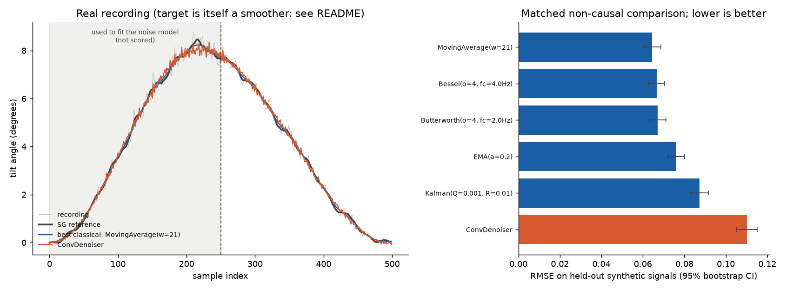

# gyro-denoise-benchmark

**A tuned classical filter beats a 1D convolutional denoiser on MEMS gyroscope data — RMSE 0.064 against 0.110, on every one of 100 test signals.**
Getting to that answer required finding and fixing three methodology bugs that had each made the network look good. Those bugs are the interesting part.




---

## Results

Held-out synthetic test set, 100 signals. Every method runs non-causally and is tuned in that mode, so the comparison measures denoising and not phase lag. Lower is better.

| Method | RMSE | 95% CI |
|:---|---:|:---|
| **MovingAverage (w=21)** | **0.0644** | 0.0606 – 0.0687 |
| Bessel (4th order, 4 Hz) | 0.0666 | 0.0627 – 0.0705 |
| Butterworth (4th order, 2 Hz) | 0.0671 | 0.0633 – 0.0711 |
| EMA (α = 0.2) | 0.0759 | 0.0718 – 0.0801 |
| Kalman (Q = 0.001) | 0.0873 | 0.0828 – 0.0916 |
| ConvDenoiser (PyTorch) | 0.1101 | 0.1052 – 0.1151 |

Five paired Wilcoxon tests, Holm-Bonferroni corrected: the network is worse than every baseline on every one of the 100 signals (p ≈ 2e-17). Against the best baseline its error is 71% higher, which is the same gap read the other way: the filter's error is 41% lower.

**Full tables → [`results/tables/summary.md`](results/tables/summary.md)** — generated by the code, never edited by hand.

### Why the network loses

It is not undertrained. Training ran 381 epochs, validation loss flat from ~284, ending 67% below the do-nothing baseline. Three reasons:

- **Capacity is not the constraint.** Run forwards and backwards, the winning moving average is a 41-tap symmetric triangular kernel — comfortably inside the network's receptive field, which reaches about 64 samples at the bottleneck. The network fails to find a solution it can already express.
- **The optimal estimator here is nearly linear.** Gaussian noise plus a smooth bandlimited signal means a ReLU network spends capacity approximating a linear operator and gains nothing back.
- **Deep learning needs a nonlinearity to exploit.** This problem does not have one.

---

## Quickstart

```bash
pip install torch --index-url https://download.pytorch.org/whl/cpu   # CPU build is not on PyPI
pip install -r requirements.txt

python src/data_prep.py    # reference curve, noise parameters, fit/test split
python src/train.py        # trains the denoiser (~2 min, CPU)
python src/evaluate.py     # tunes every baseline, benchmarks, writes results/

pytest -q                  # 113 tests, ~2s, no PyTorch required
```

Run in that order — `train.py` needs the noise parameters, `evaluate.py` needs the model.

---

## Three bugs, and how each was caught

Each one produced a result that looked good. That is what made them worth finding.

| # | Bug | The tell | Guard now in place |
|:--|:---|:---|:---|
| 1 | **Data leakage.** Overlapping windows shuffled before the train/val split, so nearly every validation window had a near-duplicate in training. | Validation loss sitting *below* training loss at every epoch. A 27% margin over Butterworth vanished on unseen noise. | `train.py` warns if the pattern reappears |
| 2 | **Phase mismatch.** A non-causal network compared against causal filters. Only 2 of 5 baselines actually ran zero-phase — the docstring claimed all 5. | Removing the lag improved the other three by **4–7×**. That margin had been handed to the network for free. | `test_zero_phase_mode_removes_the_lag` |
| 3 | **Training noise built from test values.** IAAFT surrogates are a *reordering of the target's own samples* — verified: identical sorted arrays, spectrum correlation 0.9999. | None. This one never produced a visibly wrong number, which is why it survived two rounds of cleanup. | `make_noise` takes three floats and no data array; a test enforces it |

**Not fixed, because one recording cannot fix it:** the reference curve is a Savitzky-Golay fit, so scoring smoothers against it is partly circular. That needs a second sensor. The real-recording table is demoted to a sanity check and the circularity is stated in the README, in `data_prep.py`, and in the program's own output.

---

## The data

A 500-sample tilt manoeuvre from an MPU-6050 at 100 Hz, from Kriještorac (2025), *Filtering MEMS Gyroscope Data: A Comparative Analysis of Noise Reduction Methods*, INFOTEH-JAHORINA (IEEE Xplore). The classical baselines are the filters compared in that paper.

<details>
<summary><b>Method — the details</b></summary>

### No ground truth

Nobody measured the true tilt at each sample. Two consequences:

**The target is a fitted curve.** A Savitzky-Golay filter (window 25, order 3) stands in for the clean signal — the same approach as the published paper. `results/tables/sg_window_sweep.csv` shows the nine candidate windows.

> This makes the *real-recording* comparison partly circular: on the held-out half, the tuned zero-phase Butterworth lands within 0.074 RMSE of the Savitzky-Golay curve, against 0.133 for the raw recording. About 44% of the distance is closed by a method that knows nothing about the signal. **The synthetic benchmark is the headline**, because there the clean curve is genuinely known.

**Training targets are synthetic.** Training on the one real curve with different noise added would let the network memorise the shape. `src/signals.py` generates a family of manoeuvres instead — randomised onset, duration, peak — so the network learns the operation, not the answer.

### The noise model

```
e[k]     = phi * e[k-1] + w[k],   w ~ N(0, 1)
noise[k] = e[k] * (slope * |angle[k]| + intercept)
```

All three parameters are estimated from the **first half** of the recording. The **second half** is the only part anything is scored on. No measured noise value ever reaches training — three numbers cross the boundary, from samples nothing is graded on.

Known limitation: the innovations are Gaussian, while the measured residual is mildly right-skewed (≈ +0.44) and heavy-tailed (excess kurtosis ≈ +0.67). Synthetic noise is slightly easier than the real thing, equally so for every method. Distributional realism was traded for a clean train/test boundary.

### Two tables, because phase is not denoising

| | Table A — matched non-causal | Table B — causal |
|:---|:---|:---|
| Classical filters | forward **and** backward, re-tuned in that mode | forward only, re-tuned in that mode |
| ConvDenoiser | as trained | **absent** — it cannot run causally |
| Answers | which method is most accurate | which could run on the microcontroller |

Every filter is re-tuned by grid search *inside each mode*, because the optimum moves: causally the lag penalty pushes towards barely filtering, zero-phase it pushes towards heavy smoothing. Tuning runs on a **separate synthetic set** — 60 curves, seed 99 — disjoint from the 100 test curves at seed 123, so no filter is scored on the data that chose its parameters. The tuning table flags any parameter landing on a grid boundary. In Table B a causal EMA (α = 0.35, RMSE 0.1439) leads — that is the comparison relevant to the embedded deployment in the published work.

### Statistics

- **Pre-specified comparisons.** ConvDenoiser against each of the five zero-phase baselines. Testing whichever two methods ranked first and second *in the same data* would make the p-value uninterpretable.
- **Uncertainty.** 95% percentile bootstrap intervals over the 100 test signals.
- **The real recording is n = 1** with no interval.

### A note on units

The recording is an integrated tilt **angle in degrees**, not an angular rate — the raw header `gyro_x_dps` is wrong; the values run 0 to 8.75° over five seconds in one rise and fall. `data_prep.py` accepts both header names and labels degrees throughout.

This qualifies one claim: MEMS scale-factor error scales with angular *rate*, not accumulated angle, so the fitted envelope describes this recording rather than the sensor. `fit_noise_envelope` runs the same regression against signal *speed* and reports both R² values so the confound is visible instead of assumed.

</details>

<details>
<summary><b>What this does not show</b></summary>

- **A tuned network.** The five baselines were grid-searched; the network's width, kernel size and learning rate were fixed at their first reasonable values and never searched. The comparison gives the baselines that advantage. The capacity argument above is why I doubt a search closes a 71% gap, but I did not run one.
- **Generalisation to other noise.** Training and synthetic test noise come from the same generator.
- **Generalisation to other signals.** One manoeuvre per curve, monotone rise and fall, peak 3–12°, always non-negative. Oscillation, drift and step changes are out of distribution.
- **A verdict from the real recording.** The target is a smoother. One symptom: zero-phase Kalman is *last* among classical filters on synthetic data (0.0873) and *first* on the real recording (0.0358). Matching a smoother is not removing noise.
- **That noise scales with tilt angle.** The envelope is a description that fits, not a physical claim.
- **Anything about a second sensor or recording.** There is one, of 500 samples.

</details>

---

## Design

Every method — classical filters and the network alike — implements one `Denoiser` interface: construct it, call `apply(signal)`, get a denoised signal back. The benchmark loops over a list of denoisers without knowing what any of them does internally, so adding a method means adding a class rather than editing the benchmark.

That is the strategy pattern, and it is also what makes the phase fix safe: the forward–backward pass lives in the base class, so there is one code path and no method can quietly get a different deal.

```
src/
  filters.py    Denoiser base class + 5 classical filters
  model.py      ConvDenoiser (PyTorch) behind the same interface
  signals.py    synthetic tilt manoeuvre generator
  noise.py      AR(1) noise, parameters only — no data
  data_prep.py  reference curve, noise fitting, fit/test split
  train.py      training loop with leak and identity-collapse guards
  evaluate.py   tuning, benchmarking, statistics, table generation
```

## License

MIT — see [`LICENSE`](LICENSE).
